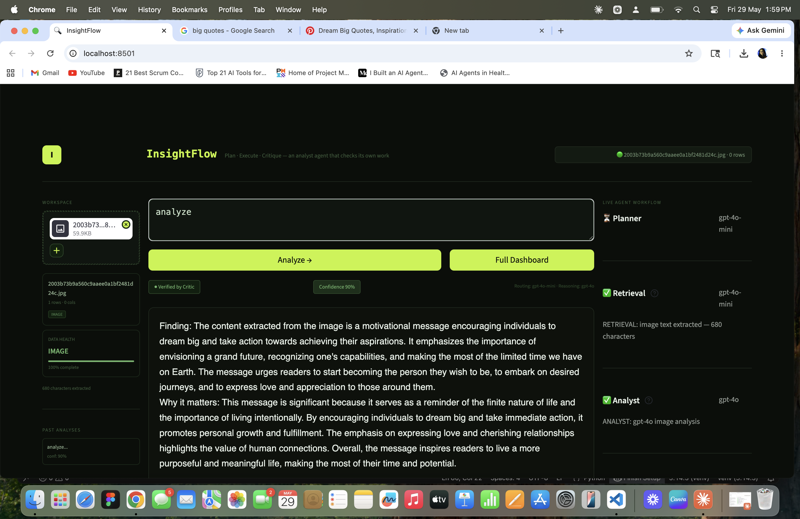
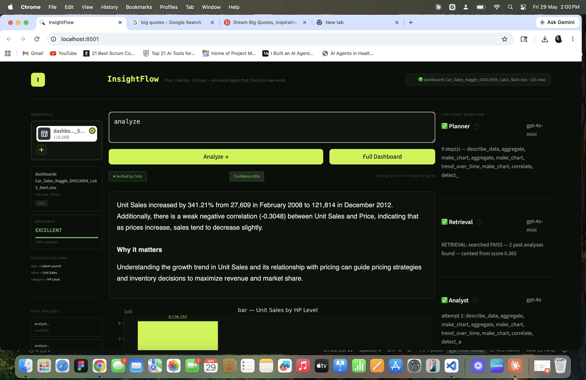
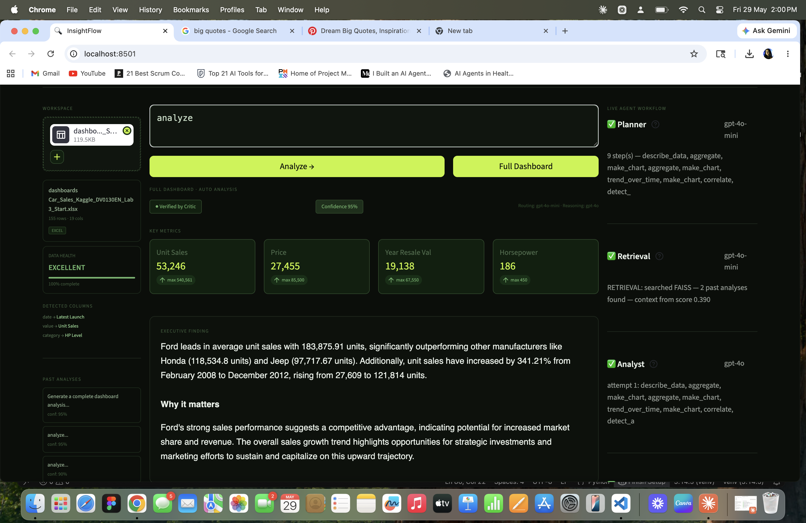
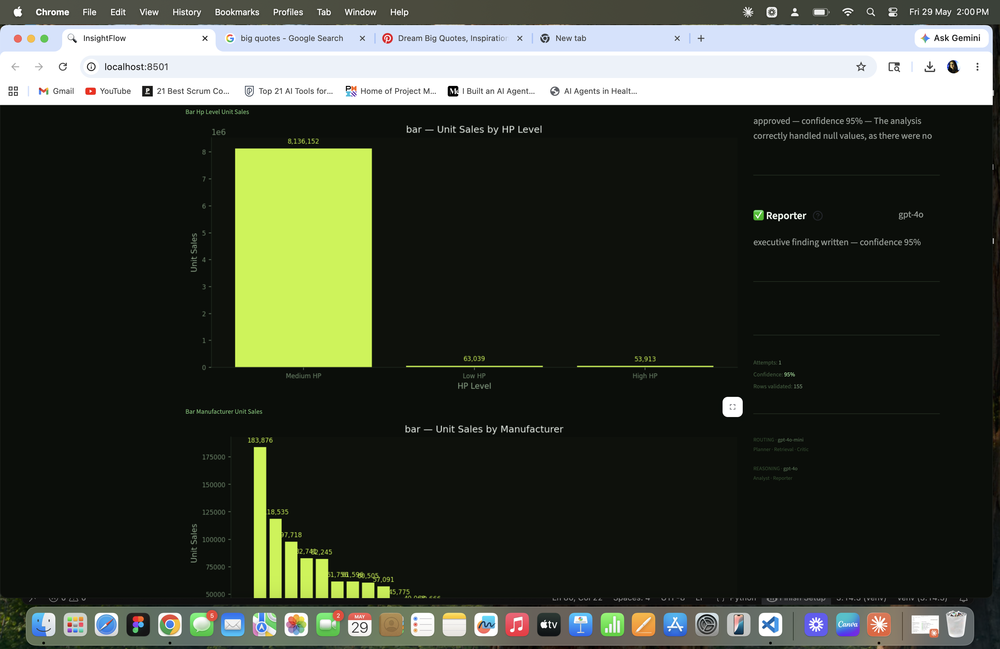
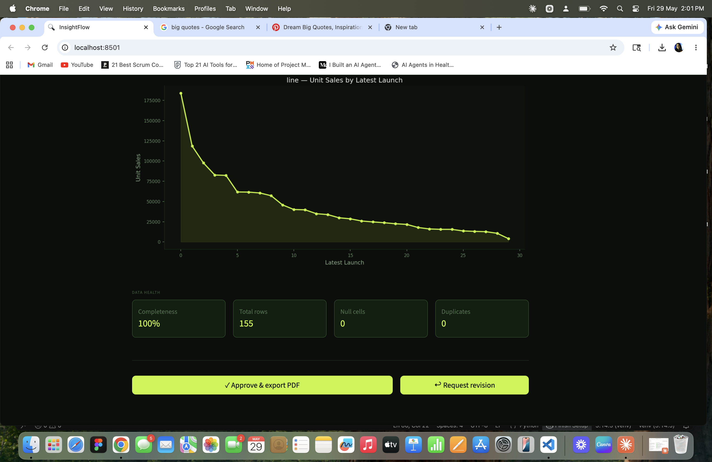

# InsightFlow — Agentic AI Data Analyst

> Plan · Execute · Critique — an analyst agent that checks its own work

InsightFlow is a multi-agent AI system that takes any data file, understands it, runs analysis, critiques its own results, and delivers a validated executive finding — all without hardcoding anything for specific datasets.

---

## What it does

Upload any CSV, Excel, PDF, or image. Ask a question or click Full Dashboard. Watch 5 AI agents collaborate to produce a validated finding with confidence score, charts, and an exportable PDF report.

---

## Screenshots

### Image Analysis — OCR + gpt-4o

### Single Question Analysis — Car Sales Excel

### Full Dashboard — KPI Cards + Executive Finding

### Full Dashboard — Auto-generated Charts

### Full Dashboard — Trend Chart + Data Health + HITL

---

## The 5-Agent Pipeline